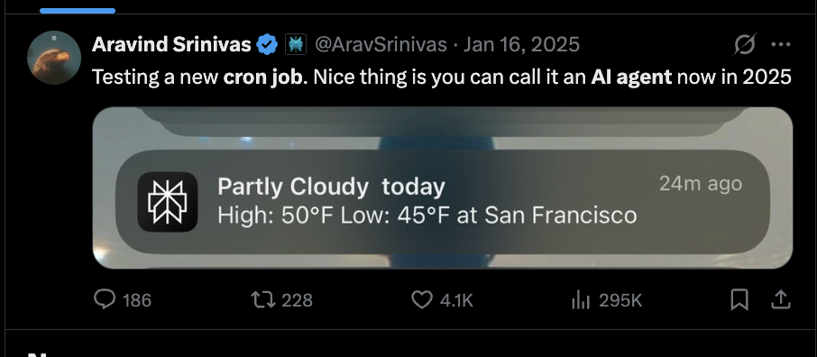

## AI Eng SF meetup: Rise of Background Agents
- [ ] 👋🌊  
- [ ] Demo 🧪
- [ ] **~~Data Pipelines~~ Knowledge Engine** (Grounding the agent)
    - ~~multisource ingestion + store~~ context synthesis
    - ~~normalize~~ entity resolution
    - Serve🍦:
        - dashboards📊 
        - 🕵️‍♀️ queries stats

- [ ] Cron vs Agents🕵️‍♀️

|  | **Cron** | **Agents** |
| :--- | :--- | :--- |
| Nature    | Deterministic (scheduled) | !-deterministic (autonomous)
| **Logic** | Executes a fixed set of instructions at a specific time. | Reasons through a goal and selects tools to achieve it. |
| **Resilience** | Brittle; 😩 if DOM changes or down API is down. | Self-healing |
| **Cost** | Negligible (server) | Variable (tokens, inf compute). |
| **Analogy** | ⏰ | 👩‍🍳 |

- [ ] cron = trigger, scraper = "worker"
- [ ] 2026 Prediction: Agent harnesses replace benchmarks
    - Real proof = agents doing multi-day tasks
    - DO droplets, cron jobs = perfect harness playground

- [ ] Where GPUs fit
    - Batch embeddings for players + games
    - Summarization jobs on large datasets
    - Fine-tuning small sports models
    - Burst GPU compute without running a $$$ box 24/7

- [ ] What's Next 🚀
    - cron trigger agent
    - Multimodal (📹 analysis)
    - Predictive Betting/Analytics
    - GitHub: [elizabethsiegle/unrivaled-data-vises-vs-wnba](https://github.com/elizabethsiegle/unrivaled-data-vises-vs-wnba)
    - Twitter: [@lizziepika](twitter.com/lizziepika)
    - [DigitalOcean SF events](https://luma.com/digitalocean)

