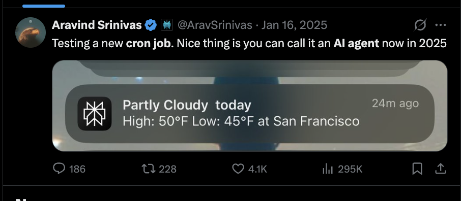

## Demo Night: Self-Updating Sports Data Knowledge Engine
- [ ] 👋🌊  
- [ ] DO = AI inference cloud☁️
- [ ] Demo 🧪
    - cron x Droplets x scrape x data vis x chat agent
- [ ] **~~Data Pipelines~~ Knowledge Engine** (Grounding the agent)
    - FastAPI endpoint + vises make raw stats into something reasonable/queriable
    - ~~multisource ingestion + store~~ context synthesis
        - only get data we need
    - Serve🍦:
        - dashboards📊 
        - 🕵️‍♀️ queries stats

- [ ] Cron vs Agents🕵️‍♀️

|  | **Cron** | **Agents** |
| :--- | :--- | :--- |
| Nature    | Deterministic (scheduled) | !-deterministic (autonomous)
| **Logic** | Executes a fixed set of instructions at a specific time. | Reasons through a goal and selects tools to achieve it. |
| **Resilience** | Brittle; 😩 if DOM changes or down API | Self-healing |
| **Cost** | Negligible (server) | Variable (tokens, inf compute). |

- [ ] What's Next 🚀
    - Multimodal (📹 analysis)
    - Claude Code on [DO GPU droplets](https://www.digitalocean.com/products/gradient/gpu-droplets)
    - Claude Code on [Telegram and DO Droplets](https://github.com/ajot/claude-code-telegram-digitalocean)
    - GitHub: [elizabethsiegle/unrivaled-data-vises-vs-wnba](https://github.com/elizabethsiegle/unrivaled-data-vises-vs-wnba)
    - Twitter: [@lizziepika](twitter.com/lizziepika)
    - [DigitalOcean SF events](https://luma.com/digitalocean)
    - Resources:
        - [Claude Code on DO droplets](https://www.digitalocean.com/community/tutorials/claude-code-gpu-droplets-vscode)
        - [Setup server env w/ Claude Code on Droplets](https://www.reddit.com/r/ClaudeAI/comments/1l4jm39/claude_code_droplets_on_do_and_a_random_vps/)
        - [speed up stable diffusion on gpu droplet](https://www.digitalocean.com/community/tutorials/stable-diffusion-gpu-droplet)
        - [do fundamentals: gpu droplets blog post](https://dev.to/devopsfundamentals/digitalocean-fundamentals-gpu-droplets-o4h)
        - [Scaling Gradient with GPU Droplets and DigitalOcean Networking](https://www.digitalocean.com/community/tutorials/harnessing-gpus-glb-vpc-for-gradient-products)

